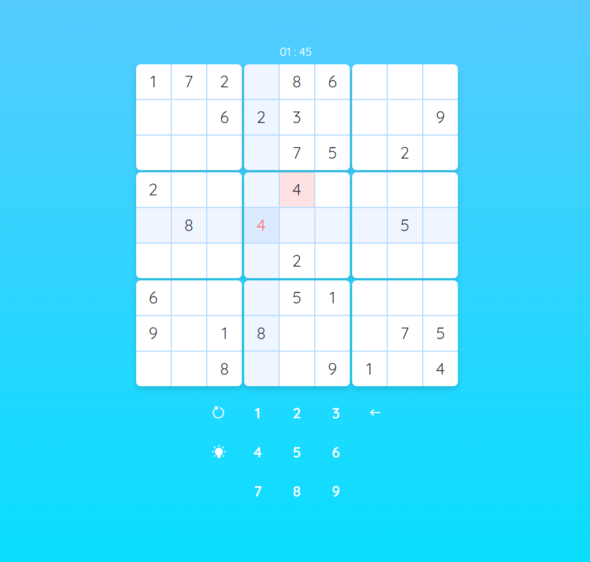

# Sudoku cruncher app

This is sudoku solver, originally create as a HackWeekly's [hackathon project](https://github.com/Hack-Weekly/tangerine-moose-sudoku) I participated on. I improved upon it little further - adding visual polish and gaming aspect.

## Table of contents

- [Overview](#overview)
  - [Screenshot](#screenshot)
  - [Links](#links)
- [My process](#my-process)
  - [Built with](#built-with)
  - [What I learned](#what-i-learned)
- [Author](#author)
- [Acknowledgments](#acknowledgments)

## Overview

Original idea was a sudoku solver and generator with a backend implementing our own backtracking algorithm. In the end we agreed on a backend using sudoku solving binary, that can solve and generate sudoku boards with various difficulty.

### Screenshot

### Links

- Live Site URL: [hosted on vercel](https://tangerine-moose-sudoku.vercel.app/)

## My process

Over the course of whole project the focus has been mostly on UI/UX. In the end we were able to create board which has some nice features like error highlights and is quite pleasant to type on even on mobile. For mobile I've created a custom keypad, which I found worked better than built in mobile keyboard for our use case.

### Built with

- [React](https://reactjs.org/) - JS library
- [Next.js](https://nextjs.org/) - React framework
- [Daisy.ui](https://daisyui.com/) - Component library
- [Tailwindcss](https://tailwindcss.com/) - CSS framework

### What I learned

A lot about React and next.js, but especially about mobile platform. It proved to me that mobile platform is hard and I should always start with it, because some quirks can have quite an impact on final product. I've also learned quite a lot about working in a team. For future me: hop on call with your team asap, figure important stuff to get first prototype going, figure small details as you go.

## Author

- Twitter - [@raswonders](https://www.twitter.com/raswonders)

## Acknowledgments

Thanks to whole Tangerine Moose team especially to [David](https://github.com/bushidavid)
